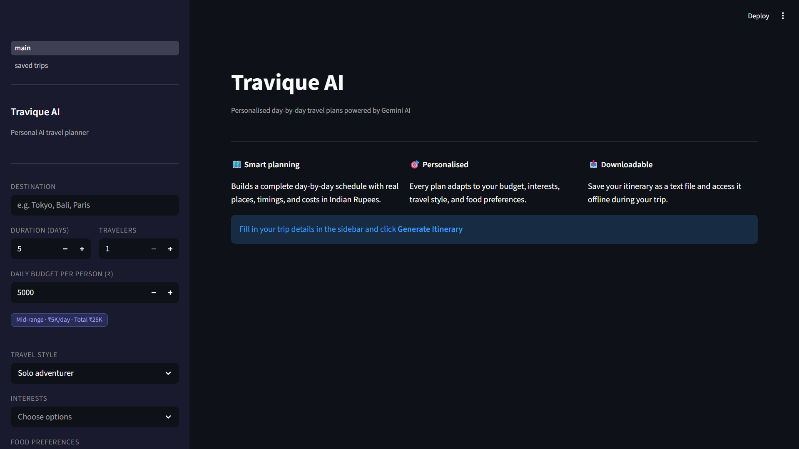
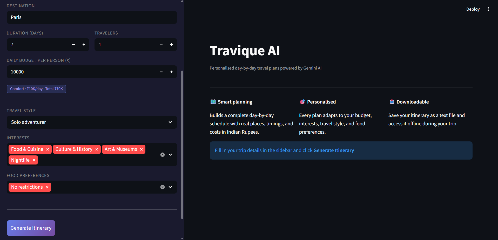
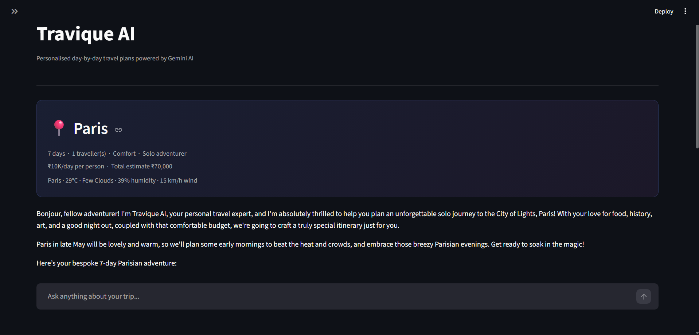
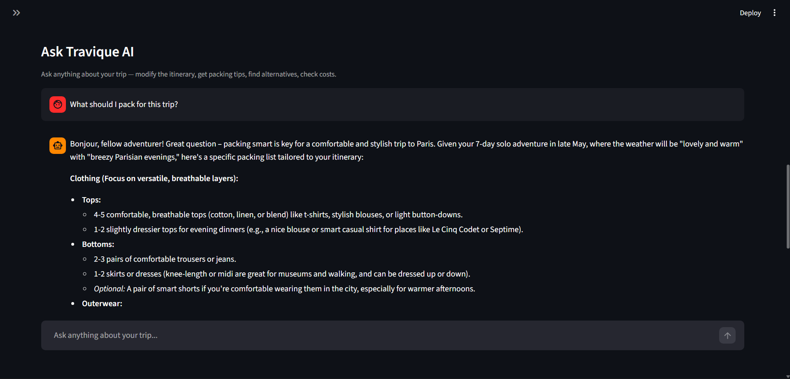

# Travique AI

### AI-Powered Smart Travel Itinerary Generator

> Paste a destination. Set your budget in ₹. Get a complete personalised 
> day-by-day travel plan with live weather, cost estimates, and an AI 
> travel assistant — in seconds.


[Live App](https://travique-ai.streamlit.app) · 
[Quick Start](#run-locally) · 
[Architecture](#architecture) · 
[Features](#features)

---

## What is Travique AI?

Travique AI is an end-to-end AI travel planner that generates 
personalised day-by-day itineraries based on your destination, budget, 
interests, travel style, and food preferences.

It doesn't give generic suggestions. It fetches **live weather** for your 
destination, builds a **weather-aware itinerary** with real place names and 
cost estimates in Indian Rupees, and then lets you **chat with an AI assistant** 
to modify the plan, get packing tips, or ask anything about your trip.
User Inputs → Live Weather Data → Gemini 2.5 Flash → Day-wise Itinerary
↓
AI Travel Chatbot
↓
SQLite Persistence

---

## Features

| Capability | Details |
|---|---|
| AI Itinerary Generation | Day-by-day plans with real places, timings, and cost estimates in ₹ |
| Live Weather Integration | Fetches current weather via OpenWeather API and adjusts suggestions |
| INR Budget System | Smart budget labels — Backpacker to Luxury — all costs in Indian Rupees |
| Food Preferences | Vegetarian, Vegan, Halal, Jain, Street food, Desserts, and more |
| Multi-turn AI Chatbot | Ask follow-ups — modify plans, get packing tips, find alternatives |
| Save Itineraries | SQLite database — save, revisit, and delete past trips |
| Download | Export any itinerary as a .txt file for offline use |
| Suggestion Chips | One-click prompts to get started with the chatbot instantly |

---

## Screenshots

### Homepage


### Planning form


### Generated itinerary


### AI travel chatbot


---

## Architecture
User Input (Streamlit Sidebar)
↓
Weather Service → OpenWeather API (live forecast)
↓
Prompt Engineering → Injects weather + preferences as context
↓
AI Service → Google Gemini 2.5 Flash
↓
Structured Itinerary (parsed by DAY sections → tabbed display)
↓
Travel Chatbot (full itinerary as context → multi-turn conversation)
↓
SQLite Database (save / view / delete)

---

## Tech Stack

**AI / LLM**
- Google Gemini 2.5 Flash
- Structured prompt engineering
- Multi-turn conversation with context management

**APIs**
- OpenWeather API — live weather + 5-day forecast

**Frontend + Backend**
- Streamlit — UI, session state, multipage routing

**Database**
- SQLite — local persistence with full CRUD

**Infrastructure**
- Streamlit Community Cloud — deployment
- Git + GitHub — version control with feature branching

---

## Project structure
Travique-AI/
├── app/
│   ├── main.py                  # Streamlit UI and app logic
│   ├── services/
│   │   ├── ai_service.py        # Gemini API + prompt engineering
│   │   ├── weather_service.py   # OpenWeather API integration
│   │   └── chat_service.py      # Multi-turn chatbot logic
│   └── pages/
│       └── saved_trips.py       # Saved itineraries page
├── data/
│   └── database.py              # SQLite CRUD operations
├── docs/
│   └── screenshots/             # App screenshots
├── .streamlit/
│   └── config.toml              # Dark theme config
├── requirements.txt
└── README.md

---

## Run locally

**1. Clone the repository**
```bash
git clone https://github.com/naman33/Travique-AI.git
cd Travique-AI
```

**2. Create a virtual environment**
```bash
python -m venv venv
venv\Scripts\activate        # Windows
source venv/bin/activate     # Mac/Linux
```

**3. Install dependencies**
```bash
pip install -r requirements.txt
```

**4. Add your API keys**

Create a `.env` file in the root folder:
GEMINI_API_KEY=your_gemini_api_key_here
OPENWEATHER_API_KEY=your_openweather_api_key_here

Get keys at:
- Gemini: https://aistudio.google.com
- OpenWeather: https://openweathermap.org/api

**5. Run the app**
```bash
cd app
streamlit run main.py
```

---

## Deployment

Deployed on Streamlit Community Cloud with secrets managed through
the Streamlit secrets manager — API keys never touch GitHub.

Auto-deploys on every push to `main`.

---

## Roadmap

- [x] AI itinerary generation with Gemini 2.5 Flash
- [x] INR budget system with smart labels
- [x] Live weather integration
- [x] Save and revisit past itineraries
- [x] Multi-turn travel chatbot
- [ ] Cloud database (Supabase) for persistent saves on live app
- [ ] Google Maps links for every location
- [ ] PDF export of itineraries
- [ ] Voice input support

---

## Author

Naman Pal — [github.com/naman33](https://github.com/naman33)

---

*Built with Python, Streamlit, and Google Gemini 2.5 Flash*